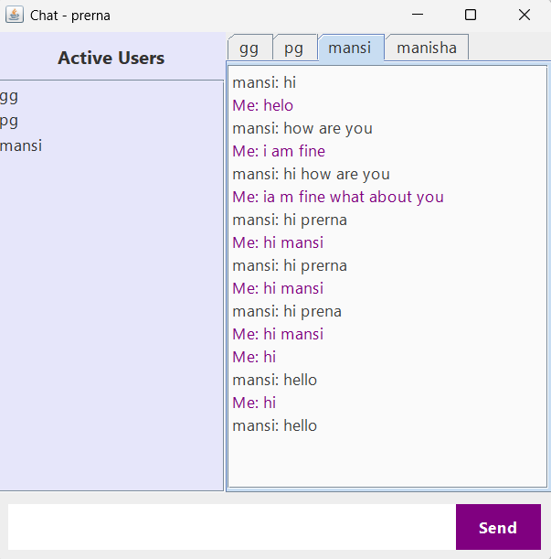

# 💬 Java Chat Application

This is a simple multi-user private messaging application built using Java Swing for the UI, **JDBC** for database interaction, and **Java Sockets** with **multithreading** for networking and concurrency.

---

## Project Structure
```
chat-application/
│-- src/
│   ├── com/mycompany/
│   │   ├── MainFrame.java
│   │   ├── ChatServer.java
│-- README.md
```
---

## 🧩 Components Explained

### 🖥️ `MainFrame.java` (Client GUI)

This file contains the code for the **chat application's user interface**:
- Built using **Java Swing**.
- Users can:
  - Select chat partners from the sidebar.
  - Switch between chat tabs.
  - Send/receive private messages.
  - View chat history after login.
- Core GUI elements include:
  - `JTabbedPane`: Separate chat tabs for each user.
  - `JList`: Sidebar showing currently online users.
  - `JTextPane`: Area to display chat messages with styling.

🔗 It connects to the server via `Socket` on port **6001**.

### ⚙️ `ChatServer.java` (Server Side)

This is the **back-end server** which:
- Listens for incoming client connections.
- Creates a **new thread** for each user using the `ClientHandler` class (enables **multithreading**).
- Handles:
  - User registration and chat history via **JDBC and MySQL**.
  - Receiving messages and forwarding them to the correct recipient.
  - Broadcasting the list of currently connected users.

---

## 💾 Why JDBC?

- Used to **connect to a MySQL database**.
- Saves:
  - New users in a `users` table.
  - Each private message in a `messages` table.
- Ensures:
  - **Persistence**: Users can see previous chat history even after disconnecting and reconnecting.
  - **Scalability**: Easily track and manage communication data.

---

## 🔁 Why Multithreading?

- Each client connection is handled in a **separate thread (`ClientHandler`)**.
- Benefits:
  - Multiple clients can chat **simultaneously**.
  - The server stays **responsive** and doesn't block other users while handling one.

---

## 🌐 Why Networking (Java Sockets)?

- Enables **real-time communication** between clients and server over the network.
- The server listens on a specific port (`6001`).
- Clients connect via `Socket`, sending/receiving data using `DataInputStream` and `DataOutputStream`.

---

## 🗃️ Database Schema

Make sure you have a MySQL database named `chat_app` with the following schema:

```sql
-- Users table (if not created)
CREATE TABLE IF NOT EXISTS users (
    id INT AUTO_INCREMENT PRIMARY KEY,
    username VARCHAR(50) NOT NULL UNIQUE,
    joined_at TIMESTAMP DEFAULT CURRENT_TIMESTAMP
);

-- Messages table
CREATE TABLE IF NOT EXISTS messages (
    id INT AUTO_INCREMENT PRIMARY KEY,
    sender VARCHAR(50) NOT NULL,
    receiver VARCHAR(50) NOT NULL,
    message TEXT NOT NULL,
    sent_at TIMESTAMP DEFAULT CURRENT_TIMESTAMP,
    FOREIGN KEY (sender) REFERENCES users(username),
    FOREIGN KEY (receiver) REFERENCES users(username)
);
```

---

## 🚀 How to Run

### Prerequisites

- Java JDK 8 or later
- MySQL Server
- JDBC Driver added to your classpath

### 1. Start the Server
```bash
javac ChatServer.java
java com.mycompany.ChatServer
```

### 2. Start the Clients
```bash
javac MainFrame.java
java com.mycompany.MainFrame
```

- Enter a unique username when prompted.

---

## 🔐 Notes

- Change database credentials in `ChatServer.java`:
```java
private static final String DB_USER = "your_username";
private static final String DB_PASSWORD = "your_password";
```

---

## 📷 UI Preview



